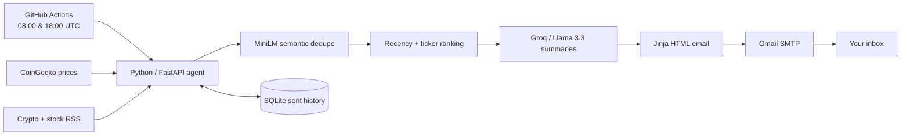

# FinPulse

[](https://github.com/AaditHire/FinPulse/actions/workflows/run-digest.yml)
[](https://www.python.org/)
[](https://nextjs.org/)
[](LICENSE)

FinPulse is a free, open-source AI agent that watches BTC, ETH, and stock-news feeds, removes duplicate coverage, ranks what matters to a portfolio, and emails a polished HTML digest twice a day.

It uses only public data and free-tier services: CoinGecko, RSS, Groq, GitHub Actions, Gmail SMTP, Vercel, and SQLite.

**[View the live landing page](https://web-sand-pi-45.vercel.app)** · **[Run the digest workflow](https://github.com/AaditHire/FinPulse/actions/workflows/run-digest.yml)**

## Architecture



The workflow restores and saves the SQLite file through the GitHub Actions cache. Without that step, a fresh runner would forget previously delivered links on every run.

## What it does

- Fetches BTC and ETH prices and 24-hour change from CoinGecko.
- Normalizes CoinDesk, Cointelegraph, Yahoo Finance, and Google News RSS items.
- Removes semantic duplicates above `0.85` cosine similarity with `all-MiniLM-L6-v2`.
- Ranks stories by freshness and direct asset mention, capped at five per ticker.
- Asks Groq's `llama-3.3-70b-versatile` for grounded summaries and sentiment.
- Sends responsive, inline-CSS email through a Gmail app password.
- Records URL hashes only after a successful send so failed deliveries can be retried.

## Local setup

Requirements: Python 3.11 and a free [Groq API key](https://console.groq.com/keys).

```bash
python -m venv .venv
# macOS/Linux
source .venv/bin/activate
# Windows PowerShell
.venv\Scripts\Activate.ps1

pip install -r requirements.txt
cp .env.example .env
```

Edit `agent/portfolio.json` to set the assets you care about. `EMAIL_TO` in `.env` overrides its `email_to` field.

For Gmail SMTP, enable 2-Step Verification on the sending Google account, create an app password, and set that 16-character value as `SMTP_PASS`. Do not use your normal Gmail password.

Run a preview without sending:

```bash
python -m agent.main --dry-run
```

The rendered file is written to `data/digest-preview.html`. Run `python -m agent.main` to send. For the optional API mode, run `uvicorn agent.main:app --reload`; it exposes `GET /health` and `POST /run`.

## Test

```bash
pytest -q
```

Tests inject tiny deterministic embeddings, so they do not download a model or call external services.

## GitHub Actions

Add these repository secrets in **Settings → Secrets and variables → Actions**:

| Secret | Required | Purpose |
|---|---:|---|
| `GROQ_API_KEY` | Yes | Free Groq summarization |
| `SMTP_USER` | Yes | Gmail sender address |
| `SMTP_PASS` | Yes | Gmail app password |
| `EMAIL_TO` | Yes | Digest recipient |
| `CRYPTOPANIC_KEY` | No | Reserved optional news-source key |

The included workflow runs at `08:00` and `18:00` UTC and can also be started manually. GitHub cron schedules always use UTC.

## Landing page and Vercel

The landing page lives in `web/`.

```bash
cd web
npm install
npm run dev
npm run build
```

Import the repository in Vercel and set **Root Directory** to `web`. The GitHub button defaults to this repository; `NEXT_PUBLIC_GITHUB_URL` can override it for a fork. No server-side environment variables are needed.

## Project layout

```text
agent/                    Python agent, sources, pipeline, email, SQLite
tests/test_pipeline.py    Fast deterministic pipeline tests
.github/workflows/        Scheduled digest runner
web/                      Next.js + Tailwind landing page
requirements.txt          Pinned Python dependencies
.env.example              Local configuration template
```

## Notes

- Public RSS endpoints can rate-limit or change format. FinPulse treats one failed source as non-fatal and continues with the rest.
- The free Groq and CoinGecko tiers have usage limits; the twice-daily schedule is intentionally conservative.
- Summaries are informational and are not financial advice.

## License

MIT
