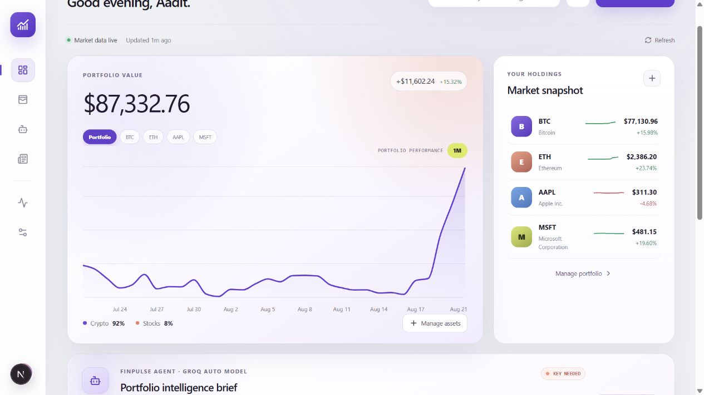
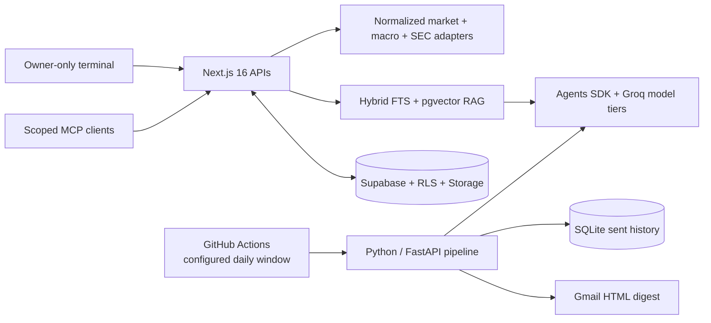

# FinPulse

[](https://github.com/AaditHire/FinPulse/actions/workflows/run-digest.yml)
[](https://www.python.org/)
[](https://nextjs.org/)
[](LICENSE)

FinPulse Terminal is a personal, research-only financial workstation. It combines live portfolio monitoring with normalized equity, crypto, and macro data, SEC filings, document RAG, cited Groq synthesis, approval-gated alerts, and an authenticated MCP endpoint. The existing Python agent continues to own scheduled digest delivery until the Phase 5 cutover.

The default deployment targets managed free tiers: Vercel, Supabase Postgres/pgvector/Storage/Auth, Groq, CoinGecko, Yahoo, official macro APIs, SEC EDGAR, RSS, GitHub Actions, and Gmail SMTP. Alpaca IEX data is an optional data-only adapter.

> The current Vercel URL still serves the previous landing-page release. The dashboard overhaul is intentionally being reviewed locally before deployment.



## Architecture



The workflow restores and saves the SQLite file through the GitHub Actions cache. Without that step, a fresh runner would forget previously delivered links on every run.

## What it does

- Values personal holdings from live market prices and renders both a portfolio graph and selectable 30-day graphs for every holding.
- Adds and validates arbitrary Yahoo Finance stock tickers plus BTC, ETH, SOL, XRP, BNB, ADA, DOGE, AVAX, LINK, DOT, LTC, BCH, and SUI.
- Uses magic-link owner authentication and RLS-backed portfolio persistence when Supabase is configured; local mode preserves the browser fallback and imports it once after first login.
- Exposes Monitor, Research, Macro, Alerts, Data Health, and MCP Access workspaces with a keyboard command palette.
- Normalizes provider, timestamp, freshness, and exchange coverage. Alpaca Basic is labeled as live IEX single-exchange data, while Yahoo remains an explicit best-effort fallback.
- Ingests SEC filings and owner uploads into sanitized chunks with local 384-dimensional embeddings and hybrid reciprocal-rank retrieval.
- Runs a deterministic research orchestrator with specialist policies, per-model quota reservations, cited-output guardrails, and evidence-only degradation.
- Provides one Streamable HTTP MCP endpoint at `/api/mcp` with hashed, scoped personal access tokens and no brokerage or order tools.
- Aggregates and searches up to 30 current stories from portfolio-specific feeds.
- Runs a server-side, multi-step Groq analysis over the live prices and headlines. A key can come from the server environment or the dashboard's session-only connection form.
- Fetches crypto through CoinGecko with Yahoo Finance fallback, and fetches stock quotes and history through Yahoo Finance.
- Normalizes CoinDesk, Cointelegraph, Yahoo Finance, and Google News RSS items.
- Removes semantic duplicates above `0.85` cosine similarity with `all-MiniLM-L6-v2`.
- Ranks stories by freshness and direct asset mention, capped at five per ticker.
- Uses an allowed Groq production model for grounded summaries and sentiment, preferring `openai/gpt-oss-120b` and avoiding retired model IDs.
- Sends responsive, inline-CSS email through a Gmail app password.
- Provides a dashboard schedule panel for recipient, delivery time, timezone, pause/resume, and one-click test emails.
- Records URL hashes only after a successful send so failed deliveries can be retried.

## Local setup

Requirements: Python 3.11 and a free [Groq API key](https://console.groq.com/keys).

```bash
python -m venv .venv
# macOS/Linux
source .venv/bin/activate
# Windows PowerShell
.venv\Scripts\Activate.ps1

pip install -r requirements.txt
cp .env.example .env
```

Edit `agent/portfolio.json` to set the assets you care about. `EMAIL_TO` in `.env` overrides its `email_to` field.

For Gmail SMTP, enable 2-Step Verification on the sending Google account, create an app password, and set that 16-character value as `SMTP_PASS`. Do not use your normal Gmail password.

Run a preview without sending:

```bash
python -m agent.main --dry-run
```

The rendered file is written to `data/digest-preview.html`. Run `python -m agent.main` to send. For the optional API mode, run `uvicorn agent.main:app --reload`; it exposes `GET /health` and `POST /run`.

## Test

```bash
pytest -q
```

Tests inject tiny deterministic embeddings, so they do not download a model or call external services.

## GitHub Actions

Add these repository secrets in **Settings → Secrets and variables → Actions**:

| Secret | Required | Purpose |
|---|---:|---|
| `GROQ_API_KEY` | Yes | Free Groq summarization |
| `SMTP_USER` | Yes | Gmail sender address |
| `SMTP_PASS` | Yes | Gmail app password |
| `EMAIL_TO` | Yes | Digest recipient |
| `CRYPTOPANIC_KEY` | No | Reserved optional news-source key |

The workflow checks twice an hour and the Python agent sends only inside the delivery window stored in `agent/digest_schedule.json`. The dashboard updates this file locally without writing the recipient or Gmail credentials into Git. The default is `08:00 Asia/Kolkata`; the workflow can also be started manually.

## Personal dashboard

The functional Next.js dashboard lives in `web/`. Copy its environment template before starting:

```bash
cd web
npm install
cp .env.example .env.local
npm run dev
npm run build
```

You can activate the interactive AI agent in either of two ways:

- Paste a free Groq key into **Integrations → Groq API key**. It is kept only in that browser tab's session and cleared when the tab closes.
- Set `GROQ_API_KEY` in `web/.env.local` for a persistent local server configuration.

SMTP values remain optional unless email delivery is being tested. `.env.local` is ignored by Git.

The **Digest schedule** card on the dashboard lets you:

- choose the recipient email, local delivery time, and timezone;
- pause or resume scheduled delivery;
- save the schedule for the Python/GitHub Actions agent; and
- send a fresh test digest without changing the sent-article history.

Recipient details are stored under the ignored `data/` directory. The tracked schedule contains only time, timezone, and enabled state.

For Vercel, set **Root Directory** to `web` and add the same server-side secrets in the Vercel project environment. No secret should use a `NEXT_PUBLIC_` prefix.

## Terminal foundation setup

1. Create a Supabase project. From the repository root, link the Supabase CLI and apply `supabase/migrations/202608250001_terminal.sql` with `supabase db push`.
2. In Supabase Auth, enable email magic links and allow `http://localhost:3000/auth/callback` plus the production callback URL.
3. Copy `web/.env.example` to `web/.env.local`. Set the Supabase URL/keys, `FINPULSE_OWNER_EMAILS`, and `SEC_USER_AGENT`; add `GROQ_API_KEY` for server-side synthesis.
4. Start the terminal with `cd web`, `npm install`, and `npm run dev`, then open `http://localhost:3000`.

When Supabase variables are absent, the app intentionally runs in local compatibility mode. That is useful for UI review; Auth, RLS persistence, uploads, alerts, PATs, and measured capacity require Supabase.

Production workflows need repository secrets `FINPULSE_APP_URL`, `KEEPALIVE_SECRET`, and `CRON_SECRET`. The keep-alive workflow is independent of provider ingestion. If a free project pauses or becomes unreachable, follow `docs/SUPABASE_RECOVERY.md`.

### MCP clients

Create a token in **MCP Access**, copy it once, and configure a Streamable HTTP client with:

```json
{
  "url": "https://your-finpulse.vercel.app/api/mcp",
  "headers": { "Authorization": "Bearer fp_REDACTED" }
}
```

Tool groups use `market_*`, `research_*`, and `portfolio_*` prefixes. `alerts:write` is separately scoped and approval-gated. There are no order, brokerage-account, or position-mutation tools.

### Verification and evaluation

```bash
cd web
npm run typecheck
npm test
npm run build

# Calls the real running API and Groq adapter; defaults to all 40 cases.
GROQ_API_KEY=... FINPULSE_EVAL_BASE_URL=http://localhost:3000 npm run eval
```

Use `EVAL_LIMIT=5` for a lower-quota smoke run. The complete suite covers equities, crypto, macro, filings, portfolio reasoning, insufficient evidence, malicious source text, and the research-only boundary.

## Project layout

```text
agent/                    Python agent, sources, pipeline, email, SQLite
tests/test_pipeline.py    Fast deterministic pipeline tests
.github/workflows/        Scheduled digest runner
web/                      Next.js dashboard, server tools, Groq agent route
docs/                     Local dashboard review screenshots
requirements.txt          Pinned Python dependencies
.env.example              Local configuration template
```

## Notes

- Public RSS endpoints can rate-limit or change format. FinPulse treats one failed source as non-fatal and continues with the rest.
- The free Groq and CoinGecko tiers have usage limits; the twice-daily schedule is intentionally conservative.
- Summaries are informational and are not financial advice.

## License

MIT
